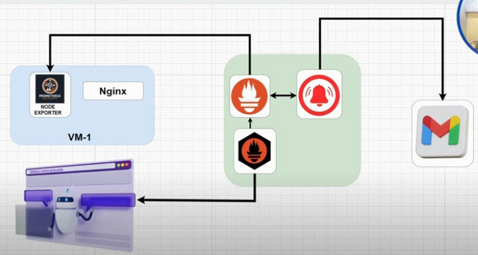

# **AWS Chat App Deployment with Monitoring**

This project demonstrates a real-time chat application built using **Node.js** and **Socket.io**, deployed on AWS EC2 with **NGINX** as a reverse proxy. The application integrates monitoring tools like **Prometheus**, **Blackbox Exporter**, **Node Exporter**, and **Alertmanager** for observability and alerting.

---

## **Features**

- Real-time messaging with **Socket.io**
- Secure traffic management using **NGINX**
- **Prometheus**-based monitoring and alerting
- Auto-restart on EC2 instance reboot

---

## **Setup Guide**

### **1. Clone Repository**

```bash
git clone https://github.com/AdeebHaider137/wechat.git
cd wechat
```

### **2. Install Dependencies**

```bash
npm install
```

### **3. Deploy on AWS**

- **VPC Setup**:
  - Create a custom VPC with public/private subnets.
  - Attach an internet gateway for external access.
- **EC2 Instances**:
  - Launch an EC2 instance for the app.
  - Install **Node.js** and **NGINX**.
  - Configure Node Exporter on the app instance.
  - Set up a monitoring instance with **Prometheus**, **Blackbox Exporter**, and **Alertmanager**.
- **NGINX Configuration**:
  - Reverse proxy traffic to the application.

---

## **Monitoring Workflow**

- Prometheus scrapes metrics from Node Exporter and Blackbox Exporter.
- Alertmanager sends email alerts for critical issues.



---

## **Usage**

1. Run the application locally:
   ```bash
   npm run dev
   ```
2. Access the app via your EC2 instance public IP or Route 53 domain.

